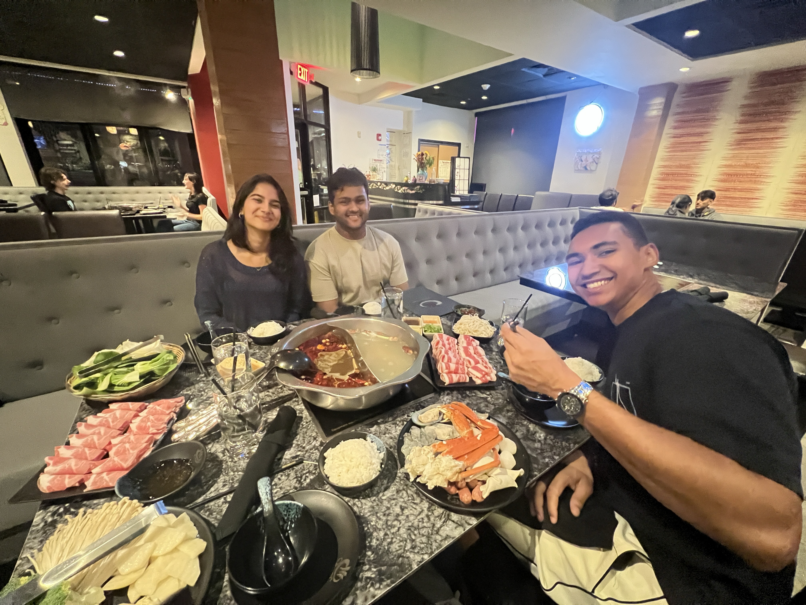

# TrueView: AI-Powered Deepfake and AI-Generated Media Detection

TrueView is a comprehensive web application designed to detect AI-generated images and videos, as well as identify deepfakes. Built during Hack Harvard 2025, this project addresses the growing challenge of distinguishing authentic media from synthetic content in an era where AI-generated imagery is becoming increasingly sophisticated.

## Table of Contents

- [The Problem We're Solving](#the-problem-were-solving)
- [Our Journey and Technical Challenges](#our-journey-and-technical-challenges)
- [How It Works](#how-it-works)
- [Architecture Overview](#architecture-overview)
- [Key Features](#key-features)
- [Technology Stack](#technology-stack)
- [Installation and Setup](#installation-and-setup)
- [Usage](#usage)
- [API Documentation](#api-documentation)
- [Performance Optimizations](#performance-optimizations)
- [Demo Media](#demo-media)
- [Future Enhancements](#future-enhancements)
- [Contributors](#contributors)
- [License](#license)

## The Problem We're Solving

With the rapid advancement of generative AI models like DALL-E, Midjourney, Stable Diffusion, and video generation tools, distinguishing between authentic and AI-generated media has become increasingly difficult. Deepfakes pose serious threats to:

- Personal privacy and reputation
- News authenticity and journalism integrity
- Legal evidence validity
- Social media trust
- Corporate security

TrueView provides a user-friendly interface that combines specialized AI detection APIs with in-house computer vision analysis to give users confidence in the authenticity of media they encounter.

## Our Journey and Technical Challenges

### The Initial Approach: API-Only Detection

When we started building TrueView, our first instinct was to rely entirely on specialized AI detection APIs. We integrated the AIorNot API, which provides robust detection capabilities for both images and videos. The API returns confidence scores for:

- AI generation detection
- Deepfake detection

While this approach worked, we quickly realized a critical limitation: **the API was a black box**. We received a binary verdict (AI-generated or authentic) with a confidence score, but we had no insight into **why** the API made that determination. Users would see "85% confidence this is AI-generated" but wouldn't understand what specific characteristics led to that conclusion.

This lack of explainability was a significant problem. If we wanted TrueView to be educational and trustworthy, users needed to understand the reasoning behind the detection.

### The Breakthrough: In-House Computer Vision Analysis

We realized we needed to build our own analysis layer that could extract and explain the visual characteristics that distinguish AI-generated media from authentic content. This led us to develop the `MediaAnalyzer` class using OpenCV.

The challenge was identifying which metrics actually matter. Through research and experimentation, we discovered that AI-generated media exhibits distinct patterns in:

**For Images:**
- **Texture Variance**: AI models often produce overly smooth textures, lacking the natural noise and imperfections of real photographs
- **Edge Density**: The ratio of detected edges to total pixels reveals whether an image has been artificially sharpened or smoothed
- **Color Variance**: AI-generated images sometimes have unnaturally uniform color distributions
- **Edge Continuity**: Real photos have broken, irregular edges due to natural lighting and focus, while AI images often have suspiciously continuous edges

**For Videos:**
- **Motion Consistency**: AI-generated or interpolated videos often have unnaturally smooth motion between frames
- **Motion Standard Deviation**: Real videos have varied motion (fast and slow movements), while synthetic videos can be too uniform
- **Edge Consistency**: How stable edges remain between frames reveals whether content is naturally filmed or synthetically generated
- **Texture Variance Over Time**: Real videos show natural variation in fine details as lighting and perspective change

### The Explainability Challenge: Enter Gemini API

Having raw metrics was a start, but presenting numbers like "Edge Density: 0.0847" to users wasn't helpful. We needed to translate these technical measurements into plain English explanations that anyone could understand.

This is where Google's Gemini API became crucial. We built an `ExplainabilityEngine` that:

1. Takes the raw computer vision metrics from our OpenCV analysis
2. Constructs detailed prompts with context about what each metric means
3. Sends these prompts to Gemini's generative AI model
4. Receives natural language explanations that describe what the metrics indicate

For example, instead of showing "Average Motion: 4.2", Gemini would explain: "The motion between frames is unusually low (4.2), suggesting this video may have been AI-interpolated or generated, as real footage typically shows more natural camera movement and jitter."

## How It Works

### Detection Pipeline

1. **File Upload**: User uploads an image or video through the React frontend
2. **Primary Detection**: The backend sends the file to the AIorNot API for initial AI/deepfake detection
3. **Computer Vision Analysis**: Our `MediaAnalyzer` class processes the media using OpenCV to extract visual metrics
4. **Overall Explanation Generation**: The `ExplainabilityEngine` uses Gemini API to generate a comprehensive analysis summary
5. **Immediate Response**: The frontend receives and displays the verdict, confidence scores, and overall reasoning
6. **Async Metric Analysis**: The frontend triggers a background request for detailed metric explanations
7. **Metric Display**: Individual metrics populate with AI-generated explanations as they become available

### Metric Analysis Details

#### Image Analysis Metrics

**Texture Variance**
- Measures local variance of fine details using Laplacian operator
- Real photos: 250-600 (natural noise and imperfections)
- AI-generated: < 200 (overly smooth, fake texture)

**Edge Density**
- Ratio of detected edges (Canny edge detection) to total pixels
- Real photos: 0.03-0.10 (natural detail level)
- Suspicious: < 0.02 (blurry) or > 0.12 (oversharpened)

**Color Variance**
- Measures diversity in color saturation across RGB channels
- Real photos: 3000-8000 (natural color variation)
- Suspicious: < 2500 (uniform palette) or > 10000 (over-saturated)

**Edge Continuity**
- Average contour length of detected edges
- Real photos: 20-80 pixels (broken, irregular edges)
- Suspicious: < 15 (fragmented) or > 90 (melting/overconnected)

#### Video Analysis Metrics

**Average Motion**
- Mean pixel intensity change between consecutive frames
- Real footage: 10-50 (natural movement and camera jitter)
- Suspicious: < 10 (overly smooth, AI-interpolated) or > 50 (frame drops, synthetic artifacts)

**Motion Standard Deviation**
- Variation in motion across the video sequence
- Real videos: 5-20 (realistic variation in movement speed)
- Suspicious: < 5 (too uniform, AI smoothing) or > 20 (erratic, glitchy transitions)

**Edge Consistency**
- Stability of detected edges between frames
- Real videos: 5-30 (edges fluctuate with lighting and perspective)
- Suspicious: < 5 (too stable, AI-generated) or > 30 (edge distortion, poor compositing)

**Texture Variance**
- Frame-to-frame variation in fine detail
- Real videos: 100-10,000 (high diversity depending on surfaces and lighting)
- Suspicious: < 100 (overly clean, AI diffusion) or > 10,000 (noise injection, compression artifacts)

## Architecture Overview

### Backend (Python/FastAPI)

```
backend/
├── save_file.py          # Main API endpoints
├── detector.py           # AIorNot API integration
├── attrClassifier.py     # OpenCV-based media analysis
├── explainability.py     # Gemini API integration for explanations
└── .env                  # API keys (not in repo)
```

**Key Components:**

- **FastAPI Server**: Handles file uploads, serves static media files, and provides REST API endpoints
- **AIorNot Integration**: Communicates with external AI detection API for primary verdicts
- **MediaAnalyzer Class**: Performs computer vision analysis using OpenCV (Canny edge detection, Laplacian variance, motion analysis)
- **ExplainabilityEngine Class**: Generates natural language explanations using Google Gemini API

### Frontend (React/TypeScript)

```
frontend/src/
├── pages/
│   ├── Upload.tsx        # File upload interface
│   └── Dashboard.tsx     # Results display with async metric loading
├── components/
│   └── AnalysisReasoning.tsx  # Reasoning points display
└── main.tsx              # App entry point with routing
```

**Key Components:**

- **Upload Page**: Drag-and-drop file upload with loading states
- **Dashboard Page**: Displays analysis results with circular progress indicators for confidence scores
- **Async Metric Loading**: Uses React hooks (useEffect) to fetch detailed metrics after initial page load
- **Responsive Design**: Built with Tailwind CSS and Radix UI components

## Key Features

### 1. Dual Detection System
- Primary detection via specialized AIorNot API
- Secondary analysis via in-house OpenCV metrics
- Combined approach provides both accuracy and explainability

### 2. Comprehensive Explainability
- Overall analysis summary explaining the verdict
- Individual metric breakdowns with plain English descriptions
- Visual indicators showing which metrics are suspicious

### 3. Support for Multiple Media Types
- Images: PNG, JPG, JPEG, WEBP
- Videos: MP4, MOV, MKV
- Automatic format detection and appropriate analysis pipeline

### 4. Real-Time Confidence Scoring
- Separate confidence scores for AI generation and deepfake detection
- Visual circular progress indicators
- Color-coded verdicts (red for detected, green for authentic)


### 5. Educational Interface
- Explains what each metric measures
- Shows expected ranges for authentic media
- Highlights suspicious values with context

## Technology Stack

### Backend
- **Python 3.9+**: Core programming language
- **FastAPI**: Modern, fast web framework for building APIs
- **OpenCV (cv2)**: Computer vision library for image and video analysis
- **NumPy**: Numerical computing for metric calculations
- **Google Generative AI (Gemini)**: Natural language explanation generation
- **Requests**: HTTP library for external API calls
- **Python-dotenv**: Environment variable management
- **Uvicorn**: ASGI server for running FastAPI

### Frontend
- **React 18**: UI library for building interactive interfaces
- **TypeScript**: Type-safe JavaScript for robust code
- **Vite**: Fast build tool and development server
- **React Router**: Client-side routing
- **Tailwind CSS**: Utility-first CSS framework
- **Radix UI**: Accessible component primitives
- **Framer Motion**: Animation library for smooth transitions
- **Lucide React**: Icon library

### External APIs
- **AIorNot API**: Specialized AI and deepfake detection service
- **Google Gemini API**: Large language model for generating metric analysis, making it more palatable for non technical users.

## Installation and Setup

### Prerequisites
- Python 3.9 or higher
- Node.js 18 or higher
- npm or yarn package manager

### Backend Setup

1. Clone the repository:
```bash
git clone <repository-url>
cd TrueView/backend
```

2. Create a virtual environment:
```bash
python -m venv venv
source venv/bin/activate  # On Windows: venv\Scripts\activate
```

3. Install dependencies:
```bash
pip install -r requirements.txt
```

4. Create a `.env` file in the backend directory:
```env
AIORNOT_API_KEY=your_aiornot_api_key_here
GEMINI_API_KEY=your_gemini_api_key_here
```

5. Start the backend server:
```bash
uvicorn save_file:app --reload --port 8000
```

The backend will be available at `http://localhost:8000`

### Frontend Setup

1. Navigate to the frontend directory:
```bash
cd ../frontend
```

2. Install dependencies:
```bash
npm install
```

3. Start the development server:
```bash
npm run dev
```

The frontend will be available at `http://localhost:8080`

### API Keys

You'll need to obtain API keys from:

1. **AIorNot API**: Sign up at [https://aiornot.com](https://aiornot.com) to get your API key
2. **Google Gemini API**: Get your API key from [Google AI Studio](https://makersuite.google.com/app/apikey)

## Usage

### Basic Workflow

1. **Open the Application**: Navigate to `http://localhost:8080` in your web browser

2. **Upload Media**: 
   - Click the upload area or drag and drop an image or video file
   - Supported formats: PNG, JPG, JPEG, WEBP, MP4, MOV, MKV
   - Wait for the initial analysis (4-6 seconds)

3. **View Results**:
   - The dashboard displays immediately with the uploaded media
   - Two verdict cards show AI detection and deepfake detection results
   - Circular progress indicators show confidence percentages
   - Overall reasoning points explain the verdict

4. **Examine Metrics**:
   - Detailed metrics load asynchronously below the main results
   - Each metric shows:
     - Display name and actual value
     - Expected range for authentic media
     - AI-generated explanation of what the value indicates
     - Status indicator (normal, suspicious low, suspicious high)

5. **Upload Another File**: Click "Back to Upload" to analyze additional media

## API Documentation

### POST /upload

Upload a media file for analysis.

**Request:**
- Method: POST
- Content-Type: multipart/form-data
- Body: Form data with "file" field containing the media file

**Response:**
```json
{
  "status": "success",
  "filename": "example.jpg",
  "path": "/media/example.jpg",
  "size": 1234567,
  "type": "image",
  "ai_detected": true,
  "ai_confidence": 0.923,
  "is_deepfake": false,
  "deepfake_confidence": 0.121,
  "ai_scan_result": { ... },
  "analysis_result": { ... },
  "briefOverview": "This image shows several characteristics..."
}
```

### POST /get-metric-explanations

Generate detailed explanations for individual metrics (called asynchronously by frontend).

**Request:**
- Method: POST
- Content-Type: application/json
- Body:
```json
{
  "analysis_result": {
    "metadata": { ... },
    "metrics": { ... },
    "raw_data": { ... }
  }
}
```

**Response:**
```json
{
  "status": "success",
  "metricExplanations": [
    {
      "metric_name": "avg_texture_variance",
      "display_name": "Average Texture Variance",
      "actual_value": 187.45,
      "expected_range": "250-600",
      "description": "Measures local variance of fine details",
      "analysis": "The texture variance is below the expected range...",
      "status": "suspicious_low"
    },
    ...
  ]
}
```

### GET /media/{filename}

Retrieve uploaded media files (served as static files).

**Request:**
- Method: GET
- Path: /media/{filename}

**Response:**
- Content-Type: image/* or video/*
- Body: Binary file content

## Performance Optimizations

### 1. Asynchronous Metric Generation

**Problem**: Initial implementation generated all metric explanations synchronously, causing 15-20 second wait times.

**Solution**: Split the upload endpoint into two phases:
- Phase 1: Return basic results with overall analysis (4-6 seconds)
- Phase 2: Generate detailed metrics asynchronously via separate endpoint

**Impact**: Perceived load time reduced by 60-70%, dramatically improving user experience.

### 2. Efficient Edge Detection

**Problem**: Canny edge detection can be slow on high-resolution images.

**Solution**: Convert images to grayscale before edge detection, reducing computational complexity.

**Impact**: Edge analysis runs 3x faster without sacrificing accuracy.

### 3. Cached Gemini Responses

**Future Enhancement**: Implement caching for similar metric patterns to avoid redundant API calls.

## Demo Media

### Test Images

**AI-Generated Images:**

*AI-generated cow image showing characteristic over-smoothing*

**Authentic Images:**

*Authentic photograph with natural texture and lighting*


*Real photograph showing natural edge characteristics*


### Video Demo

[Full Application Demo Video](./demo/trueview_demo.mp4)
*Complete walkthrough of TrueView's features and capabilities*

## Future Enhancements

### 1. Browser Extension
Develop a Chrome/Firefox extension that allows users to right-click any image or video on the web and analyze it instantly.

### 2. Advanced Metrics
Incorporate additional detection methods:
- Frequency domain analysis (FFT)
- EXIF metadata examination
- Compression artifact analysis
- Face landmark consistency (for deepfakes)

### 3. Mobile App
Develop native iOS and Android applications for on-the-go media verification.

## Contributors

This project was built during Hack Harvard 2025 by a dedicated team passionate about combating misinformation and promoting media authenticity.

**Team Members:**
- Arav De - Backend Development, Computer Vision Analysis
- Aryandeep Ray - Frontend Development, UI/UX Design
- Adam Cooper - API Integration, Performance Optimization
- Galina Pokitko - Frontend Development, UI/UX Design

---

## Acknowledgments

- **AIorNot** for providing the specialized AI detection API
- **Google** for the Gemini API that powers our explainability engine
- **OpenCV Community** for the robust computer vision library
- **Hack Harvard 2025** for the opportunity to build this project

---

Built with dedication during Hack Harvard 2025. Fighting misinformation, one upload at a time.